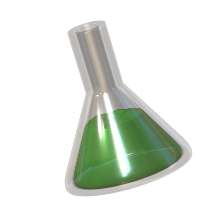

<!--

DreamCatalyst (arXiv 2024.07)

Authors
* Jiwook Kim (https://github.com/tom919654)
* Seonho Lee (https://github.com/glanceyes)
* Jaeyo Shin (https://github.com/j-mayo)
* Jiho Choi (https://github.com/JihoChoi)

-->


<h1 align="center">

DreamCatalyst: Fast and High-Quality 3D Editing via Controlling Editability and Identity Preservation
</h1>
<h4 align="center">
<a href="https://scholar.google.co.kr/citations?user=i0OKV8wAAAAJ&hl=en">Jiwook Kim<sup>*</sup></a>, <a href="https://scholar.google.co.kr/citations?user=DFKGTG0AAAAJ&hl=en">Seonho Lee<sup>*</sup></a>, <a href="https://scholar.google.com/citations?user=UbZM7nQAAAAJ&hl=en">Jaeyo Shin</a>, <a href="https://scholar.google.co.kr/citations?user=uvwpFpIAAAAJ&hl=en">Jiho Choi</a>, <a href="https://scholar.google.co.kr/citations?user=KB5XZGIAAAAJ&hl=en">Hyunjung Shim</a><br>
</h4>
<h5 align="center">
(*Equal contribution)<br>
</h5>

<h4 align="center">

[](https://arxiv.org/abs/2407.11394)
[](https://dream-catalyst.github.io/)


This is the official implementation of **DreamCatalyst**.

</h4>


<br/>


https://github.com/user-attachments/assets/1615279c-a11a-420a-8680-435719cd10f1


<br/>

## News & Updates


- [ ] **[TBA]** ✨ Code will be released soon.

- [x] **[2024/07/17]** 🌟 The paper is released [here](https://arxiv.org/abs/2407.11394). 

<br/>

## Introduction

DreamCatalyst is a novel framework that interprets SDS(Score Distillation Sampling)-based editing as a diffusion reverse process. It considers the sampling dynamics, thereby its optimization process is an approximation of the diffusion reverse process in editing tasks. This method aims to reduce training time and improve editing quality. DreamCatalyst presents two modes: (1) a faster mode, which edits the NeRF scene in only about 25 minutes, and (2) a high-quality mode, which produces superior results in less than 70 minutes.


<div align="center">
    
</div>


## Citation

If you find our work useful in your research, please cite:

```BiBTeX
@misc{kim2024dreamcatalystfasthighquality3d,
      title={DreamCatalyst: Fast and High-Quality 3D Editing via Controlling Editability and Identity Preservation}, 
      author={Jiwook Kim and Seonho Lee and Jaeyo Shin and Jiho Choi and Hyunjung Shim},
      year={2024},
      eprint={2407.11394},
      archivePrefix={arXiv},
      primaryClass={cs.CV},
      url={https://arxiv.org/abs/2407.11394, 
}
```


### Acknowledgement

We would like to express our gratitude to the foundational works and their contributors, including [PDS](https://posterior-distillation-sampling.github.io/), [Instruct-Nerf2Nerf](https://instruct-nerf2nerf.github.io/), [InstructPix2Pix](https://github.com/timothybrooks/instruct-pix2pix), [DreamSampler](https://arxiv.org/abs/2403.11415), and [SDEdit](https://sde-image-editing.github.io/).
